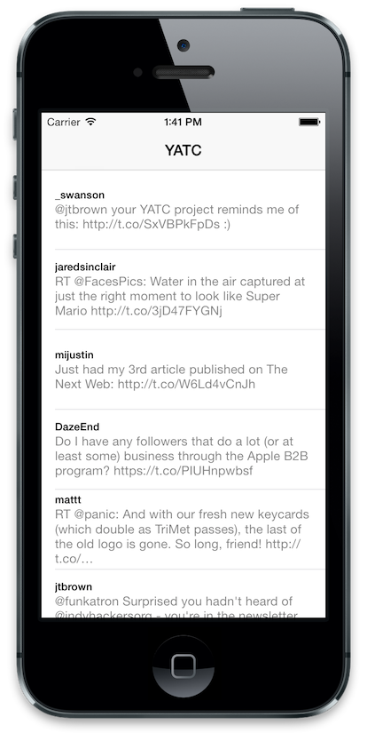

Coding Challenge: YATC (Yet Another Twitter Client)
====

YATC (pronounced "yat-see", rhymes with "cat pee") is Yet Another Twitter Client, and it doesn't exist yet! Your mission, should you choose to accept it... is to build it.

## Why Another Twitter Client?
Well...why not? There are lots of great Twitter clients out there for iOS, like Twitterrific, TweetBot, and even the official Twitter app. And there are literally dozens (hundreds?) of others. So why not jump on the bandwagon and build your own? You'll get to pull JSON from an API, parse it, and display it in a table view - all things you'd likely do in a real app you build for yourself, your company, or your client. And let's not forget that building a Twitter client gives us the unique opportunity to use the one and only **pull-to-refresh** control!

## Specs
Who needs specs when a simple screen shot will suffice? Just build this:

Well, OK, here are a few requirements:

1. The main screen should be a table view with the most recent 100 tweets from your home timeline.
2. Each cell should have (a) the Twitter username and (b) the tweet text.
3. You should be able to see at least four lines of tweet text in each cell.
4. Who needs a Twitter API key? *You* certainly don't. Just use the built-in social framework.
5. Pulling the table view down to refresh should, you know, *refresh* the screen.

## Useful links
[Twitter REST API v1.1](https://dev.twitter.com/docs/api/1.1)

## How To Participate
Here's how this works...

1. Fork this repository ([https://github.com/iOSDevTraining/YATC](https://github.com/iOSDevTraining/YATC))
2. Clone your fork to your computer.
3. Create the project in your cloned directory.
4. As you're building, make commits and push your code to GitHub (just like you normally do).
5. If you get stuck, [email us](mailto:iosdevtraining@roadfiresoftware.com) with your questions and include a link to your fork.
6. Build build build until the app works per the specs.
7. When you have the app working per the specs and you're ready for us to review and critique, create a Pull Request on GitHub. This is the way for you to signal to tell us "hey, I think I'm done" and gives us an easy way to comment on individual lines in your files as well as on your app as a whole.
8. [Send us an email](mailto:iosdevtraining@roadfiresoftware.com) to let us know you're ready for us to review your code. Include a link to the pull request.

## About
This is an [iOS Dev Training](http://iosdevtraining.com/) project by Josh Brown and Randy Edmonds.
